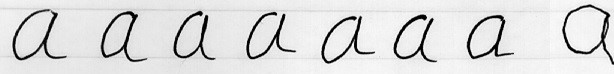

# (PART\*) Part 1: Understanding Variation {-}

# Understanding Variation {#variation}

Consider writing the letter 'a' by hand with a pen and paper. Figure \@ref(fig:variation-fig1) displays eight instances of this letter produced by one of the authors. The leftmost seven letters were written using the dominant (right) hand, and the rightmost letter was produced by the non-dominant hand.

```{r variation-fig1, fig.cap="Hanwritten a's", echo=FALSE}

```

Although the seven leftmost letters were produced under identical conditions -- same hand, date, time, place, pen, paper, temperature, lighting, and other factors—they are not identical. Instead, they exhibit controlled variation. This illustrates that a stable process inherently produces some degree of variation or "noise." In analysing this controlled variation, it might be tempting to classify some a's as better or worse than their peers, and so attempt to learn from the best while eliminating the worst. 

However, this approach is fundamentally flawed. Since all a's were produced under identical conditions, no single a is inherently better or worse than the others. From the viewpoint of the underlying process, all seven letters are equivalent because they were produced under the same conditions. The variation observed among them has a common cause which is inherent in the process itself. So how can we improve these a's?  To improve the quality of the letters we should focus on modifying the process rather than trying to draw lessons from the differences between individual letters.

To reduce variation and improve the quality of the letter a, we might consider changes such as using a different pen, paper, or surface, or switching to a computer. Of these options, it is intuitive that using a computer will yield the most significant improvements. This insight is supported by the theory of constraints, which views a process as a chain of interconnected links. The strength of the entire chain is limited by its weakest link. Improving this weakest link will enhance the overall performance, while changes to other, non-constraint links offer minimal benefit. In the context of handwriting, the weakest link is the manual use of the hand. The pen, paper, and lighting are not constraints in this process; altering them will not substantially impact the quality of the 'a'. Switching to a computer addresses the key constraint -- handwriting -- resulting in a marked improvement in the quality of the letter.

Now consider the rightmost a of Figure Figure \@ref(fig:variation-fig1). It is obviously different from the others. A casual look suggests that there must be a special cause. When we see special cause variation, we need to find the underlying special cause and then decide how to act. In other words, special cause variation requires detective work. If the special cause is having an adverse impact on our process, we must work towards eliminating it from the process. But if the special cause is having a favourable impact on our process, we can work towards learning from it and making it part of our process.

In summary then, the handwritten a's demonstrate that a process exhibits two types of variation –- common cause and special cause -– and the action required to address each type of cause is fundamentally different. To address common cause variation, we must take action on a major portion of the process. To address special cause variation, we must first do some detective work to find the cause and then we can decide to eradicate that cause (if it is unfavourable) or keep it (if it is favourable).

The originator of this theory of variation was Walter A. Shewhart, who in the 1920’s was seeking to enhance the quality of industrial products. Shewhart identified that quality is not just about meeting target specifications but involves managing variation. He distinguished between these two types of variation: common cause variation, which is inherent in the underlying process, and special cause variation, which arises from external factors. 

There are various characteristics and descriptions of common and special cause variation which are highlighted below.

--------------------------------------------------------------------------------
Common Cause Variation                    Special Cause Variation
----------------------------------------  --------------------------------------
Is caused by a stable process (like       Is caused by an assignable cause that
writing a signature) and is intrinsic     it extrinsic to the process.
to the process.

Is neither good or bad, it just is.       Can be favourable or unfavourable and
                                          premediated (as part of an improvement
                                          project) or incidental (not part of an
                                          improvement project)
                                          
Can be reduced (but not eliminated) by    Unfavourable special cause can be
changing the underlying process.          eliminated. Favourable special cause
Such changes can be informed by           can be adopted and adapted into a new
special cause variation.                  process.

Is sometimes referred to as random        Is sometimes referred to a systematic,
variation, chance variation, or noise.    non-random variation.

Depicts the voice or behaviour of a       Is a distinct signal which differs
stable process and affects all those      from the usual voice or noise of the
who are part of the process.              process which requires further
                                          detective work to identify the
                                          assignable cause.
--------------------------------------------------------------------------------
Table: Characteristics of common versus special cause variation

SPC is all about understanding variation and recognising its underlying causes -- common or special -- in order to help improve products and services. Contrary to many beliefs SPC is *not* simply a method of identifying outliers in a population.

> Statistical Process Control is not about statistics, it is not about "process-hyphen-control", and it is not about conformance to specifications. […] It is about the continual improvement of processes and outcomes. And it is, first and foremost, a way of thinking with some tools attached.
>
> -- @wheeler2000, p 152

With this insight in mind, the rest of this book is mostly about the tools -- in particular the SPC chart. In the next chapter we begin by taking a close look at the "anatomy and physiology" of SPC charts.
