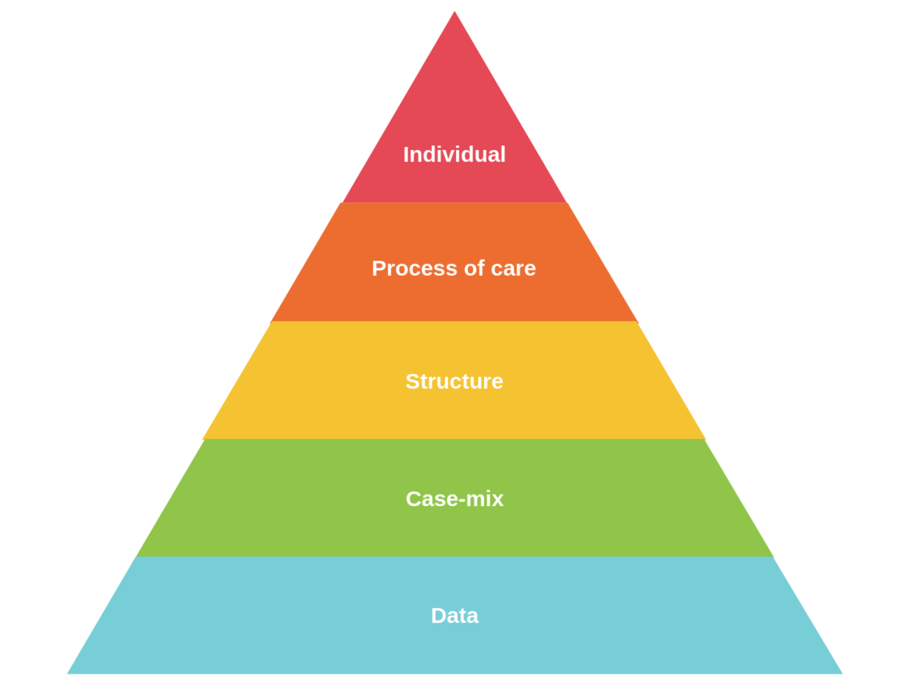

# Using SPC in Healthcare {#using}

As briefly discussed in the previous chapter, SPC methodology is used in healthcare in two main ways: to monitor the behaviour or performance of an existing process, and to support efforts to improve a process. Examples of monitoring include tracking complication rates following surgery, while examples of improvement include redesigning a care pathway for patients with fractured hips.

## Using SPC to monitor a process

In monitoring mode, the primary aim is to determine whether a process is deteriorating. Deterioration is usually indicated by signals of special cause variation, which prompt further investigation to identify and eliminate the cause. One way to undertake such detective work is by using the Pyramid Model of Investigation described below.

The central purpose of using SPC charts to monitor healthcare processes is to ensure that the quality and safety of care are adequate and not worsening. When a signal of special cause variation appears on a control chart, investigation is therefore necessary. However, the chosen method of investigation must recognise that the relationship between recorded outcomes and quality of care is often *complex, ambiguous, and open to several possible explanations* [@lilford2004]. Failure to recognise this may lead to premature conclusions and foster a culture of blame that undermines both the engagement of clinical staff and the credibility of SPC.

As @rogers2004 noted:

> If monitoring schemes are to be accepted by those whose outcomes are being assessed, an atmosphere of constructive evaluation, not 'blaming' or 'naming and shaming', is essential as apparent poor performance could arise for a number of reasons that should be explored systematically.

To address this need, @mohammed2004 proposed the **Pyramid Model for Investigation of Special Cause Variation in healthcare**, a systematic approach of hypothesis generation and testing based on five a priori candidate explanations for special cause variation: data, patient casemix, structure or resources, process of care, and carer(s) (Figure \@ref(fig:responding-fig1)).

```{r responding-fig1, fig.cap='Pyramid Model for Investigation', echo=FALSE}

```

These broad categories are arranged from the most likely explanation at the base of the pyramid to the least likely at the top. In this way, the model provides a roadmap for investigation, beginning with the simplest and most plausible explanations and progressing only as needed. The first two layers, data and casemix, focus on the validity of the data and the adequacy of any casemix adjustment. The upper three layers focus more directly on aspects of care delivery and professional practice.

A proper investigation requires a multidisciplinary team with expertise relevant to each layer of the pyramid. Such a team is also likely to include staff whose outcomes or data are being investigated, so that their experience and insight can inform the enquiry and so that they remain engaged in the process.

The basic steps in using the model are as follows. First, a multidisciplinary team is formed with sufficient expertise to assess each layer of the pyramid and to judge whether a credible explanation has been found. Next, guided by the type of pattern seen in the data -- whether freaks, shifts, trends, mixed patterns, or cyclic variation -- the team generates and tests candidate explanations, beginning at the lowest level of the pyramid and moving upwards only if the lower levels do not provide an adequate explanation. A credible cause should be supported by both quantitative and qualitative evidence. If no credible explanation can be found, the remaining possibility is that the signal was a false one.

The kinds of questions that may be asked during such an investigation include the following.

**Data**: At this level the focus is on data quality, including coding accuracy, definitions, completeness, and reliability.

- Are the data coded correctly?
- Has there been a change in coding practice, for example because less experienced coders are involved?
- Is the clinical documentation clear, complete, and consistent?

**Casemix**: Although differences in casemix may be accounted for in the analysis, some residual confounding may remain.

- Are there factors specific to this hospital that are not captured in the risk adjustment?
- Has the pattern of referrals changed in a way that is not reflected in the adjustment model?

**Structure or resources**: This includes the availability of staff, beds, equipment, and relevant organisational arrangements.

- Has there been a change in the distribution of patients across the hospital, so that more patients in this specialty are now spread across multiple wards rather than concentrated in one unit?
- Has the physical environment or organisational structure changed?

**Process of care**: This concerns treatments, pathways, and care policies.

- Has there been a change in the care being provided?
- Have new treatment guidelines been introduced?

**Professional staff or carers**: This concerns the practice and methods of those delivering care.

- Has there been a change in staffing?
- Has a key staff member received additional training and introduced a new method that may have affected outcomes?

## Using SPC to improve a process

SPC is also used to support efforts to improve a process. In healthcare, this usually involves making small-scale changes and measuring their impact on an SPC chart. In improvement mode, the main aim is to determine whether the changes made to a process have resulted in improvement. Returning to the earlier handwriting example, we might ask whether we produce better letters after switching from pen and paper to a computer. The answer depends on whether the change is followed by signals of special cause variation in the desired direction, assuming we have a credible measure of "letter quality".

The degree of alignment between changes made to the process and subsequent signals on the chart provides a story that describes the impact of those changes, both qualitatively and quantitatively.

Common cause variation can only be reduced by changing a major part of the process. But what do we mean by a major part? The Theory of Constraints [@goldratt2022] offers the analogy of a chain, whose strength is determined by its weakest link. Strengthening that weakest link strengthens the whole chain. Strengthening other links while leaving the weakest unchanged does not improve the system as a whole. In this sense, the weakest link represents the constraint on performance, and in most real systems there are only a few such constraints, perhaps only one or two, while the remaining factors are non-constraints.

A widely used framework for improvement in healthcare is the Model for Improvement, developed by [@langley2009]. This model consists of three fundamental questions together with the Plan-Do-Study-Act (PDSA) cycle.

The first question is: **What are we trying to accomplish?** This defines the aim of the improvement effort. The aim should be specific, measurable, and time-bound, and it should include a clear rationale.

The second question is: **How will we know that a change is an improvement?** This focuses attention on measurement. The team identifies the key indicators that will be used to determine whether improvement has occurred. This should also include balancing measures, which are intended to detect unintended negative consequences of change.

The third question is: **What changes can we make that will result in improvement?** This concerns the generation and testing of change ideas. These ideas are tested using the PDSA cycle:

**Plan**: Develop a plan for testing the change, including who will do what, when, and where.

**Do**: Carry out the change on a small scale.

**Study**: Examine the results, paying particular attention to the effect of the change.

**Act**: Decide whether to adopt, adapt, or abandon the change on the basis of what has been learned.

There are, of course, other approaches to improvement in healthcare, including Lean, Six Sigma, and Systems Engineering. SPC charts can support each of these approaches because they provide a robust and informative way of assessing whether a change has had the intended effect.

## Successful use of SPC in healthcare

Successful use of SPC in healthcare requires more than simply producing a chart, especially in a complex adaptive system such as healthcare. Important factors include engaging stakeholders, forming an appropriate team, defining a clear aim, selecting the process of interest, choosing the relevant measures, ensuring that data can be collected and fed back reliably, and establishing a baseline. All of this needs to take place within a culture of continual learning and improvement, supported by leadership. For examples of SPC in healthcare practice, see @mohammed2024.

At the same time, it is important to recognise that SPC charts are not always easy to construct correctly. After reviewing 64 SPC charts, @koetsier2012 found that almost half contained technical problems. This suggests a need for better training among those who construct charts and helps explain the motivation for this book.

This concludes Part 1. In Part 2, beginning with Chapter \@ref(first-chart), we turn to the practical task of producing SPC charts in R.
