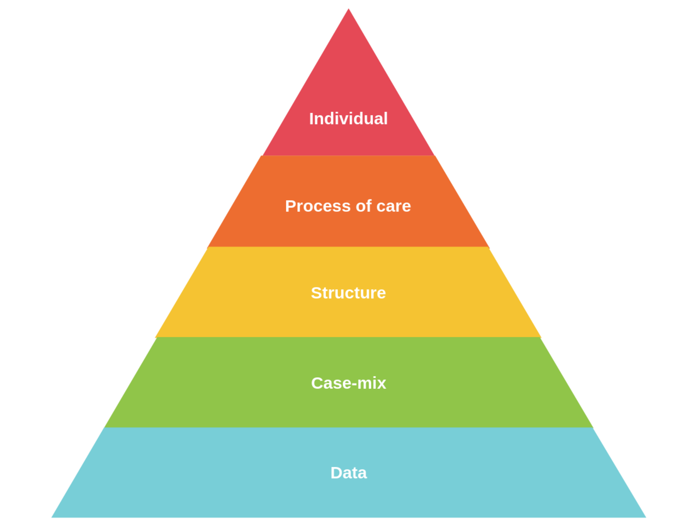

# Using SPC in healthcare {#using}

In healthcare, SPC methodology is used in two main ways:

* Monitoring the behaviour or performance of an existing process (e.g. complications following surgery), or
* Improving an existing process (e.g. redesigning the pathway for patients with fractured hips).

## Using SPC to monitor a process

In the monitoring mode, the primary aim is to determine if a process is deteriorating which is usually indicated by signals of special cause variation where detective work is undertaken to find the cause and then eliminate it. Such detective work can be undertaken by using the Pyramid Model of Investigation  describe below.

The key aim of using statistical process control charts to monitor healthcare processes is to ensure that quality and safety of care are adequate and not deteriorating. So when a signal of special cause variation is seen on a control chart monitoring a given outcome, investigation is necessary. However, the chosen method must recognise that the link between recorded outcomes and quality of care *is complex, ambiguous and subject to multiple explanations* [@lilford2004]. Failure to do so may inadvertently contribute to premature conclusions and a blame culture that undermines the engagement of clinical staff and the credibility of statistical process control. As Rogers note:

> If monitoring schemes are to be accepted by those whose outcomes are being assessed, an atmosphere of constructive evaluation, not 'blaming' or 'naming and shaming', is essential as apparent poor performance could arise for a number of reasons that should be explored systematically.
>
> -- @rogers2004

To address this need, @mohammed2004 proposed the **Pyramid Model** for Investigation of Special Cause Variation in healthcare  – a systematic approach of hypothesis generation and testing based on five a priori candidate explanations for special cause variation: data, patient case-mix, structure/resources, process of care, and carer(s) (Figure \@ref(fig:responding-fig1)).

```{r responding-fig1, fig.cap='Pyramid Model for Investigation', echo=FALSE}

```

These broad categories of candidate explanations are arranged from most likely (data) to least likely (carers), so offering a road map for the investigation that begins at the base of the pyramid and stops at the level that provides a credible, evidence-based explanation for the special cause. The first two layers of the model (data and casemix factors) provide a check on the validity of the data and casemix-adjusted analyses, whereas the remaining upper layers focus more on quality of care related issues.

A proper investigation requires a team of people with expertise in each of the layers. Such a team is also likely to include those staff whose outcomes or data are being investigated, so that their insights and expertise can inform the investigation while also ensuring their buy-in to the investigation process. Basic steps for using the model are shown below.

1. Form a **multidisciplinary team** that has expertise in each layer of the pyramid, with a decision-making process that allows them to judge the extent to which a credible cause or explanation has been found, based on hypothesis generation and testing.

1. Candidate **hypotheses** are generated and tested starting from the lowest level of the Pyramid Model and proceeding to upper levels only if the preceding levels provide no adequate explanation for the special cause.

1. A credible cause requires **quantitative and qualitative evidence**, which is used by the team to test hypotheses and reach closure. If no credible explanation can be found, then the only plausible conclusion is that signal itself was a false signal.

The types of questions that can be asked when undertaking the detective work are highlighted below.

* **Data**: Data quality issues, e.g. coding accuracy, reliability of charts, definitions, and completeness.

    * Are the data coded correctly?

    * Has there been a change in data coding practices (e.g. are there less experienced coders)?

    * Is clinical documentation clear, complete, and  consistent?

* **Case mix**: Although differences in case mix are accounted for in the calculation, it is possible that some residual confounding may remain.

    * Are there factors peculiar to this hospital not taken into account in the risk adjustment?

    * Has the pattern of referrals to this hospital changed in a way not considered in risk adjustment?

* **Structure or resource**: Availability of beds, staff, and medical equipment; institutional processes.

    * Has there been a change in the distribution of patients in the hospital, with more patients in this specialty spread throughout the hospital rather than concentrated in a particular unit?
    
    * Has the physical environment or organisational structures changed?

* **Process of care**: Medical treatments of patients, clinical pathways, patient admission and discharge hospital policies.
   
    * Has there been a change in the care being provided?
  
    * Have new treatment guidelines been introduced?

* **Professional staff/carers**: Practice and treatment methods, etc.

    * Has there been a change in staffing for treatment of patients?
  
    * Has a key staff member gained additional training and introduced a new method that has led to improved outcomes?


## Using SPC to improve a process

SPC is also used to support efforts to improve a process. In healthcare, this usually involves making small scale changes and measuring their impact on an SPC chart. In the improving mode, the primary aim is to determine if changes made to a process have been successful (or not). For example, in the handwriting process considered earlier, do we get better a's after switching to a computer. This is determined by looking to see the impact of the change in the form of signals of special cause variation on a SPC chart. 

The degree of alignment between changes to the process and subsequent signals of special cause variation provide a story which qualitatively and quantitatively describes the impact of changes.

Common cause variation can only be addressed by changing a major portion of the process. What do we mean by a major portion? The theory of constraints offers the analogy of a chain to demonstrate that the strength of the chain is determined by the weakest link. If we increase the strength of the weakest link the whole chain is strengthened. If we increase the strength of other links but not the weakest link, then the chain does not get stronger. The weakest link is the constraint on the performance of the system, and it is argued that in real systems there are usually only a few, perhaps one or two, constraining factors, all other factors are non-constraints (as demonstrated by the handwriting example earlier). [ref]

The Model for Improvement, proposed by @langley2009, is a widely used framework in healthcare to guide improvement efforts. It consists of three fundamental questions and the Plan-Do-Study-Act (PDSA) cycle.

1. **What are we trying to accomplish?**
This question defines the aim of the improvement effort, which should be specific, measurable, and time-bound along with a rationale for why this is important.

1. **How will we know that a change is an improvement?**
This question focuses on measurement. The team identifies key performance indicators and other metrics to assess whether the change has led to improvement. This includes balancing measures designed to capture unintended negative consequences from changing a system or process. 

1. **What changes can we make that will result in improvement?**
This question explores potential change ideas or interventions that could lead to the desired improvement. These ideas are undertaken according to the **PDSA Cycle**, which is a method for iterative small-scale testing of changes:

    - **Plan**: Develop a plan to test the change, including who, what, when, and where.
    - **Do**: Implement the change on a small scale.
    - **Study**: Analyze the results, focusing on the impact of the change.
    - **Act**: Decide whether to adopt, modify, or abandon the change based on the results.

There are other approaches to improvement in healthcare, such as Lean, Six Sigma, and Systems Engineering. The SPC chart can support each of these approaches because it offers a robust and insightful way to test the success or otherwise change ideas.

## Successful use of SPC in healthcare

The successful use of SPC in healthcare requires a number of factors which is more than the production of an SPC chart especially in complex adaptive systems like healthcare. These factors include:- engaging the stakeholders; forming a team; defining the aim; selecting the process of interest; defining the metrics of interest; ensuring that data can be reliably measured, collected and fed back; and establishing baseline performance – all in a culture of continual learning and improvement that is supported by the leadership team. To see examples of SPC in action in healthcare, please see @mohammed2024.

Nevertheless, it is important to note that SPC charts are not necessarily easy to construct. After examining 64 statistical process control charts, @koetsier2012 found that that almost half the charts had technical problems which suggests a need for more training for those constructing charts – which is the primary motivation for this book. 

This is the end of Part 1. In Part 2, beginning with Chapter \@ref(first-chart), we show you how to produce SPC charts using R.
